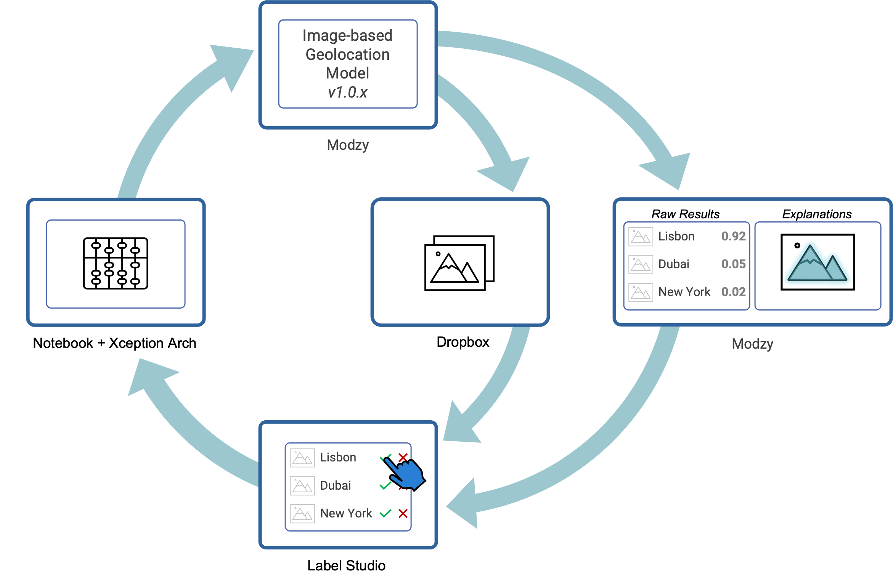

# Modzy - Label Studio Sample Project

:tv: ***Follow along on YouTube: https://youtu.be/ZOxeNHzIbfg***

This sample project demonstrates how to use Modzy and Label studio to dynamically re-label production inferences using a combination of semi-supervised learning, explainable AI, and human-in-the-loop review. This is a comprehensive and low-lift way to create training data sets from production data that can be used to retrain a machine learning model.

  

This sample project uses:
  
For model inference and explainability

As a makeshift data lake for storing images

For labeling production inference results

## Installation & Set-Up

### Label Studio Set-up
 * First, install Label Studio and start it up. Instructions can be found [here](https://github.com/heartexlabs/label-studio#try-out-label-studio) (installing with PIP was a breeze)
 * Once it's running, log in and download your API [access token](https://labelstud.io/guide/api.html#Authenticate-to-the-API)
 * Finally, create a project in Label Studio. Then go to "Settings" > "Labeling Interface" and paste in [label-classes.html](label-studio-setup/label-classes.html) as code

### Modzy Set-up
In your instance of Modzy, [create a project](https://docs.modzy.com/docs/how-to-create-a-project) and then download your project [api key](https://docs.modzy.com/docs/how-to-use-a-project).

### Dropbox Set-up
 * If you don't have one, create a free Dropbox account
 * Then, you'll need to create a [Dropbox App](https://www.dropbox.com/developers/reference/getting-started)
 * Next, give your app the following permissions: `files.metadata.write` `files.content.write` `files.content.read` `sharing.write`
 * Finally, generate an [access token](https://dropbox.tech/developers/generate-an-access-token-for-your-own-account)

### Environment Set-Up
Before you can start running the sample images as inferences, you'll need to do the following:
 * Clone this repo
 * [Optional, but recommended] Create a virtual environment within your project folder and activate it
 * Run `$ pip install -r requirements.txt` to install all necessary dependencies
 * Create a copy of [.env-sample](.env-sample) and rename it to `.env`. Then update it to include your API access tokens for Modzy, Dropbox, and Label Studio
 * Run `$ source .env` to load your environment variables
 * Update the `labelStudioURL` variable in [import-annotations.py](import-annotations.py) to the URL of your instance of Label Studio

## Usage

### Send sample images to Modzy and Dropbox
The next step will send the images in the [/images-test](/images-test) folder to a model that executes "Image-based Geolocation" which means that it will try to predict where in the world the image was taken. Then the image will be uploaded to Dropbox.

In your terminal run:

`$ python3 inference.py`

### Run import-annotations.py
Finally, send all predictions generated from Modzy over to Label Studio for review and labeling.

In your terminal run:

`$ python3 import-annotations.py`
